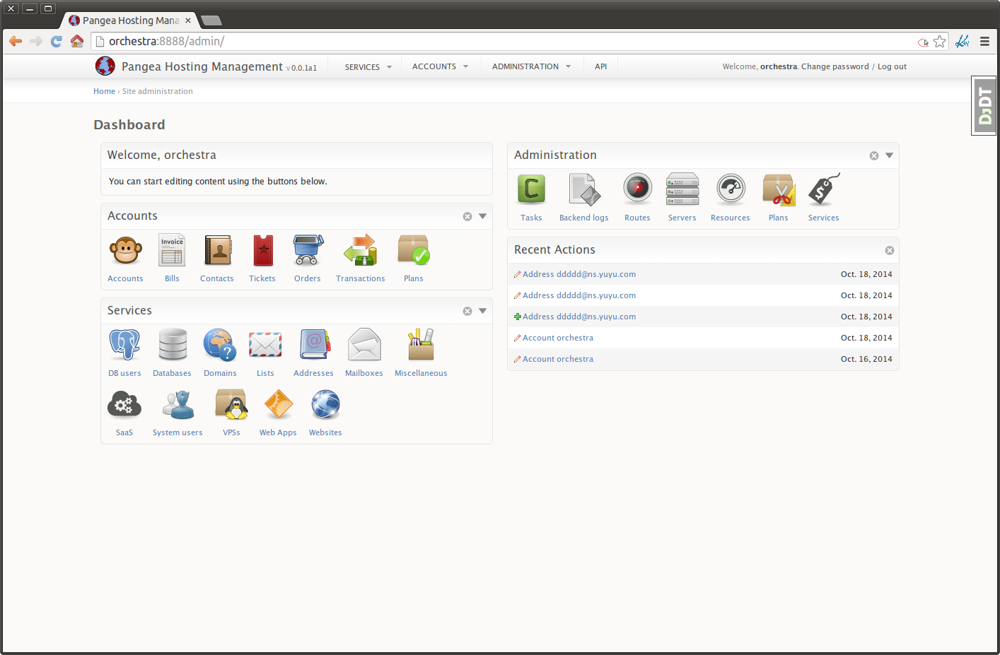

  **This project is in early development stage**

Django Orchestra
================

Orchestra is a Django-based framework for building web hosting control panels.

* [Installation](#fast-deployment-setup)
* [Roadmap](ROADMAP.md)


Motivation
----------

There are a lot of widely used open source hosting control panels, however, none of them seems apropiate when you already have an existing service infrastructure or simply you want your services to run on a particular architecture.

The goal of this project is to provide the tools for easily build a fully featured control panel that is not tied to any particular service architecture.

Overview
--------

* The **admin interface** is based on [Django Admin](https://docs.djangoproject.com/en/dev/ref/contrib/admin/). The resulting interface is very model-centric with a limited workflow pattern: change lists, add and change forms. The advantage is that only little declarative code is required.
* It does **not** provide a **customer-facing interface**, but provides a REST API that allows you to build one.
* Service [orchestration](orchestra/contrib/orchestration), [resource management](orchestra/contrib/resources), [billing](orchestra/contrib/bills), [accountancy](orchestra/contrib/orders) is provided in a decoupled way, meaning:
    * You can [develop new services](docs/create-services.md) without worring about those parts
    * You can replace any of these parts by your own implementation without carring about the others
    * You can reuse any of those modules on your Django projects
* Be advised, because its flexibility Orchestra may be more tedious to deploy than traditional web hosting control panels.





Fast Deployment Setup
---------------------

This deployment is **not suitable for production** but more than enough for checking out this project. For other deployments checkout these links:
* [Development](INSTALLDEV.md)
* [Production](INSTALL.md)

```bash
# Create and activate a Python virtualenv
# Make sure python3.x-venv package is installed on your system
python3 -mvenv env-django-orchestra
source env-django-orchestra/bin/activate

# Install Orchestra and its dependencies
pip3 install http://git.io/django-orchestra-dev
# The only non-pip required dependency for runing pip3 install is python3-dev
sudo apt-get install python3-dev
pip3 install -r http://git.io/orchestra-requirements.txt

# Create a new Orchestra site
orchestra-admin startproject panel
python3 panel/manage.py migrate
python3 panel/manage.py runserver
```

Now you can see the web interface on `http://localhost:8000/admin/`


Quick Start
-----------
0. Install django-orchestra following any of these methods:
    1. [PIP-only, Fast deployment setup (demo)](#fast-deployment-setup)
    2. [Docker container (development)](INSTALLDEV.md)
    3. [Install on current system (production)](INSTALL.md)

1. Generate a password-less SSH key for user `orchestra` and transfer it to your servers:
    ```bash
    orchestra@panel:~ ssh-keygen
    orchestra@panel:~ ssh-copy-id root@server.address
    ```
    Now add the servers using the web interface `/admin/orchestration/servers`, check that the SSH connection is working and Orchestra is able to report servers uptimes.

2. Configure your services, one at a time, staring with domains, databases, webapps, websites, ...
    1. Add related [routes](orchestra/contrib/orchestration) via `/admin/orchestration/route/`
    2. Configure related settings on `/admin/settings/setting/`
    3. If required, configure related [resources](orchestra/contrib/resources) like *account disk limit*, *VPS traffic*, etc `/resources/resource/`
    3. Test if create and delete service instances works as expected
    4. Do the same for the remaining services. You can disable services that you don't want by editing `INSTALLED_APPS` setting

3. Configure billing by adding [services](orchestra/contrib/services) `/admin/services/service/add/` and [plans](orchestra/contrib/plans) `/admin/plans/plan/`. Once a service is created hit the *Update orders* button to create orders for existing service instances, orders for new instances will be automatically created.


License
-------
Copyright (c) 2014 - Marc Aymerich and individual contributors.
All Rights Reserved.

Django-orchestra is licensed under The BSD License (3 Clause, also known as
the new BSD license). The license is an OSI approved Open Source
license and is GPL-compatible(1).

The license text can also be found here:
http://www.opensource.org/licenses/BSD-3-Clause

Redistribution and use in source and binary forms, with or without
modification, are permitted provided that the following conditions are met:
* Redistributions of source code must retain the above copyright
  notice, this list of conditions and the following disclaimer.
* Redistributions in binary form must reproduce the above copyright
  notice, this list of conditions and the following disclaimer in the
  documentation and/or other materials provided with the distribution.
* Neither the name of Marc Aymerich, nor the
  names of its contributors may be used to endorse or promote products
  derived from this software without specific prior written permission.

THIS SOFTWARE IS PROVIDED BY THE COPYRIGHT HOLDERS AND CONTRIBUTORS "AS IS"
AND ANY EXPRESS OR IMPLIED WARRANTIES, INCLUDING, BUT NOT LIMITED TO,
THE IMPLIED WARRANTIES OF MERCHANTABILITY AND FITNESS FOR A PARTICULAR
PURPOSE ARE DISCLAIMED. IN NO EVENT SHALL Ask Solem OR CONTRIBUTORS
BE LIABLE FOR ANY DIRECT, INDIRECT, INCIDENTAL, SPECIAL, EXEMPLARY, OR
CONSEQUENTIAL DAMAGES (INCLUDING, BUT NOT LIMITED TO, PROCUREMENT OF
SUBSTITUTE GOODS OR SERVICES; LOSS OF USE, DATA, OR PROFITS; OR BUSINESS
INTERRUPTION) HOWEVER CAUSED AND ON ANY THEORY OF LIABILITY, WHETHER IN
CONTRACT, STRICT LIABILITY, OR TORT (INCLUDING NEGLIGENCE OR OTHERWISE)
ARISING IN ANY WAY OUT OF THE USE OF THIS SOFTWARE, EVEN IF ADVISED OF THE
POSSIBILITY OF SUCH DAMAGE.
